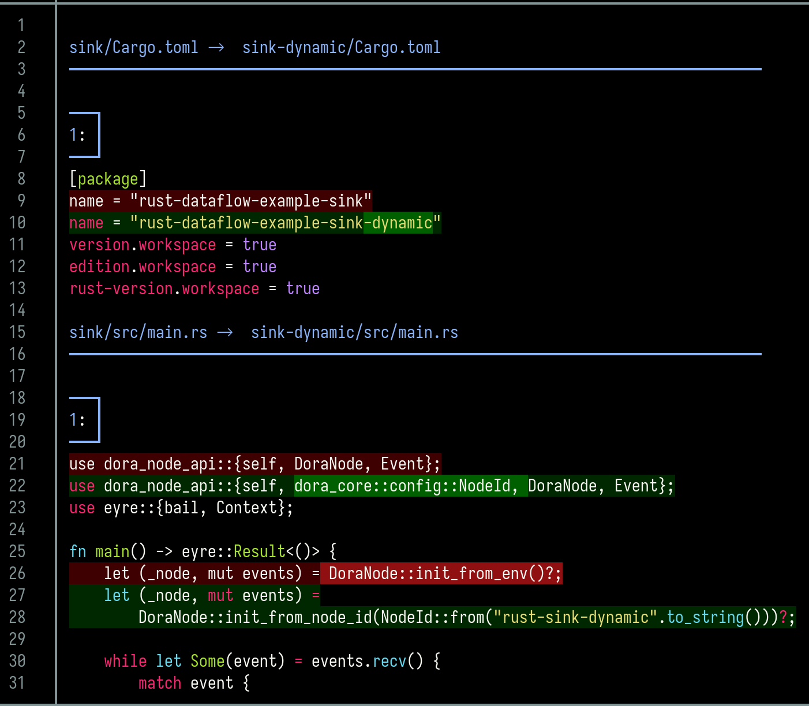

# Rust数据流（Dataflow）

> 地址：./examples/rust-dataflow
>
> 关键词：Rust，Dataflow

## 构建节点
```bash
$ dora build dataflow.yml
```

## 运行
```bash
$ dora run dataflow.yml
```

## 动态节点
Dora允许节点不一定有dataflow.yml启动，只需要预先将其path声明为dynamic即可。

### 构建
```bash
$ dora build dataflow_dynamic.yml
```
### 运行
1. 启动dataflow.yml
```bash
$ dora up
$ dora start dataflow_dynamic.yml
```
2. 在另一个终端启动动态节点
```bash
$ ../../target/debug/rust-dataflow-example-sink-dynamic
```

### 实现区别
通过工具查看动态节点与普通节点的区别
<p style="text-align:center"></p>

## 本地通信方式
Dora提供TCP、共享内存、Socket三种本地的节点通信方式。
在dataflow.yml中可以显示指定使用何种通信方式。

这是dataflow_socket.yml给出的
```yaml
communication:
  _unstable_local: UnixDomain
```

```bash
$ dora build dataflow_socket.yml
$ dora run dataflow_socket.yml
```
